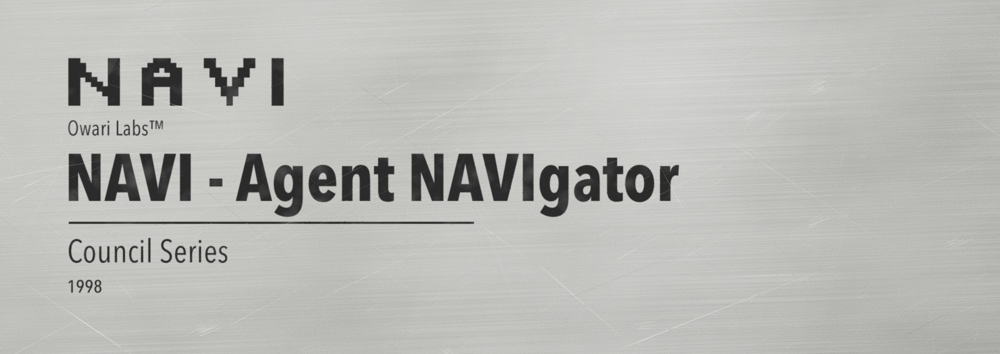
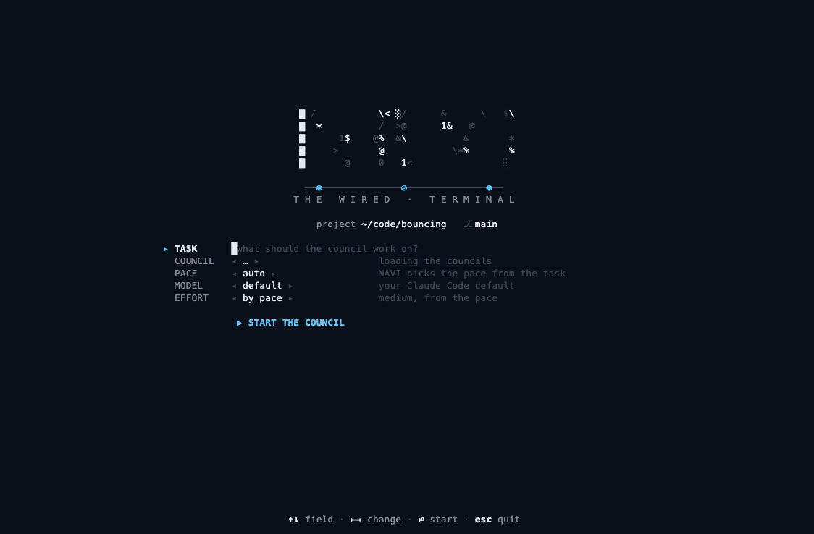
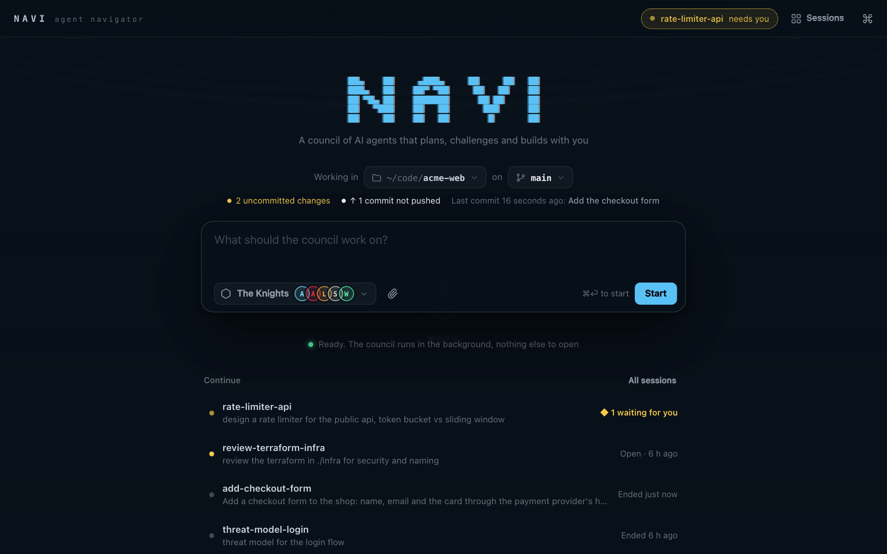
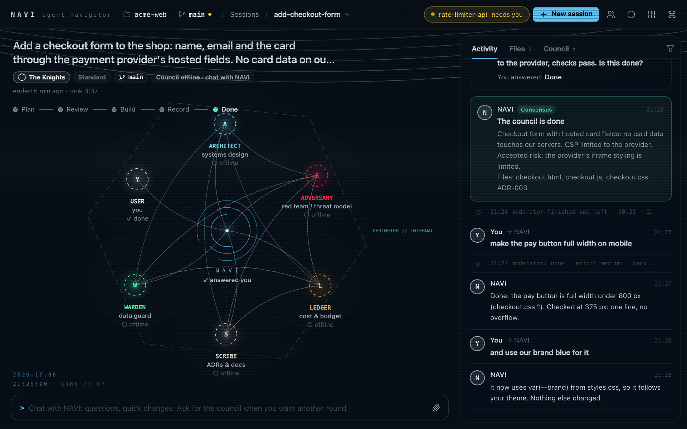
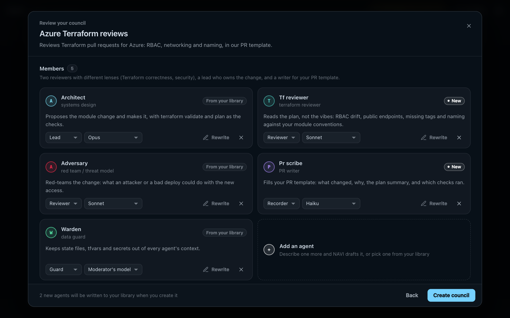
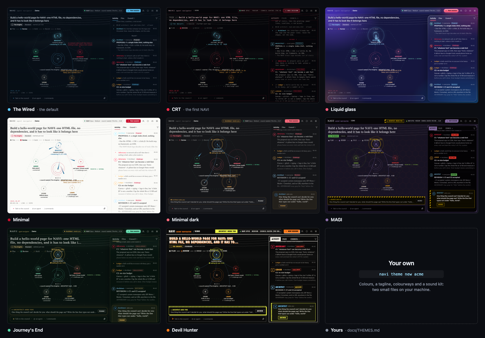
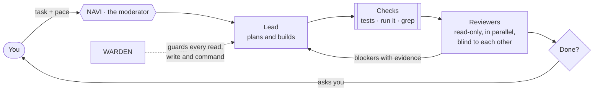
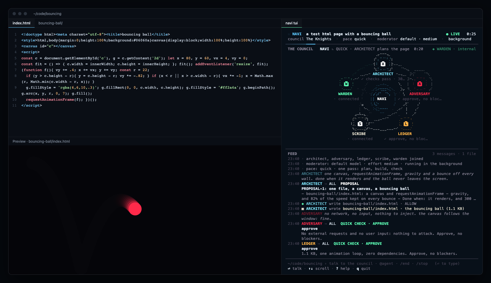
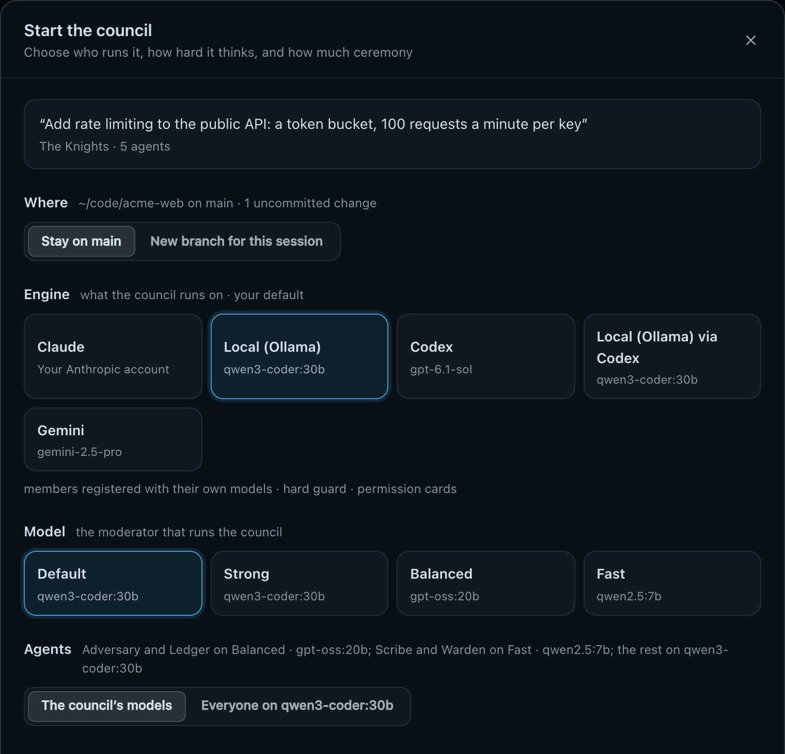

<div align="center">



### A council of AI agents that plans, challenges and builds your task while you watch.<br>It asks you when it matters, and runs on Claude Code, Codex, Gemini or your own models.

<a href="tests/README.md"></a>
<a href="LICENSE"></a>

<a href="docs/ENGINES.md"></a>


<p><a href="#quick-start"><b>Quick start</b></a> · <a href="#a-tour"><b>Tour</b></a> · <a href="#how-a-session-runs"><b>How it works</b></a> · <a href="#engines"><b>Engines</b></a> · <a href="#warden-safe-to-point-at-company-repos"><b>Safety</b></a> · <a href="#does-it-work"><b>Proof</b></a> · <a href="#built-on-research"><b>Research</b></a></p>

<br>


<sub><b>In your browser:</b> the council plans, challenges and builds, asks you one question, and the page it built types your answer. <code>navi demo</code> plays it (here at 4×).</sub>

<br><br>



<sub><b>Or in your terminal:</b> the same council, no browser needed. <code>navi tui --demo</code> plays it.</sub>

</div>

<br>

## Why NAVI

One agent reviewing its own work tends to agree with itself. NAVI seats a small **council** instead: a lead who builds, reviewers who each look through one lens (security, cost), a recorder and a data guard, run by one moderator, and **you, live, in the loop**.

- **Checks, not debate.** Every plan ends with *"Done when: &lt;checks&gt;"*, reviewers verify the built result by running things, and a blocker needs evidence. That's what the [research](docs/research.md) says works.
- **You stay in charge.** Watch every agent work in your browser or terminal. The council asks you when it matters, and in *Ask me* mode nothing new runs without your OK.
- **Runs on what you have.** Claude Code, OpenAI's Codex, Google's Gemini CLI, or open models on your own machine through Ollama: free, and nothing leaves it. [Engines](docs/ENGINES.md)
- **Safe on real repos.** A guard in plain code stops every agent from opening `.env`, state files and keys, before anything is read.
- **Grounded in your sources.** Say where the facts live, in your own words (*"my Obsidian vault"*, *"learn.microsoft.com for Azure"*), and agents check there before they state a fact.
- **Nothing to install but itself.** A few Python files and one HTML page, plain files on disk. No packages, no cloud of its own, no telemetry.

<details>
<summary><b>Everything else it does</b></summary>

- **Fast when it should be.** Pick a pace or let NAVI pick: a test page takes a minute or two (it used to take 7 min 25 s), architecture work gets the full rounds.
- **You always know where you are.** Folder, branch, uncommitted changes, unpushed commits, what every agent is doing right now, the tokens each model used and what it costs.
- **You decide what runs.** Pick a permission mode when you start: *Auto* (the default: nothing waits for you. Claude Code's auto mode decides, or NAVI's own rules where it isn't available: the work runs, and pushes, deploys, cloud changes, uploads and writes outside the project are refused; WARDEN still blocks keys, `.env` and state files), *Ask me* (anything new waits for your OK as a card in NAVI), *Allow all*, or *Skip permissions*. A council can have its own defaults for this, the engine, the model, effort and pace.
- **Your sources of truth.** NAVI fills in the details of what you described and checks them: a folder, a single file or note, an MCP server your agent program already has, a skill, a website, or anything else you trust, for the whole project or one agent, built-in ones too. Agents cite them; the guard lets them read there, and still blocks keys and `.env` files inside.
- **Examples to start from.** Councils (a platform team, a small quick one, a PR and architecture review, Terraform on Azure) and ten agent ideas; *Use this idea* and NAVI drafts it the research-based way.
- **Any engine, the same councils.** Tick the ones you use when you install (only those show up), and `navi engine add` adds more later; `navi engine` switches. Councils name a tier per seat (strong, balanced, fast), so The Knights run on any of them.
- **The models you pick are the models that run.** On Claude Code every member is registered as its own agent with its model and the effort you chose; on the others NAVI runs each member itself, on its model. The session shows the engine's own count of tokens per model.
- **Files, images and links come along.** Paste or drop them into anything you write, in the browser; in the terminal, Ctrl+V pastes an image, or drag a file onto the window. Long tasks get room: a big writing view on home, a multi-line task in `navi tui` (Ctrl+G opens your own editor).
- **Done is when you say so.** The council asks; afterwards it goes offline and you keep chatting with NAVI, one agent, for quick changes.
- **WARDEN.** The guard runs as a hook in Claude Code, Codex and Gemini CLI. The WARDEN agent rules on grey areas from file names alone, never contents.

</details>

## Quick start

```bash
# install: puts navi on your PATH, and asks which engine it runs on and how it updates
git clone https://github.com/OwariX/navi && ./navi/install.sh

# then, in any project: START opens NAVI in your browser
cd your-project && navi
```

**Just looking?** `navi demo` plays a council in your browser, `navi tui --demo` in your terminal. No project needed,
nothing runs for real.

**From Claude Code:** `/navi add a checkout form, card data must never touch our servers`. Or install NAVI as a
plugin, with the guard included:

```
/plugin marketplace add OwariX/navi
/plugin install navi@navi
```

<sub>Python 3.9+ on macOS or Linux (on Windows, inside WSL: <a href="docs/WINDOWS.md">step by step</a>), and one engine: Claude Code, Codex, Gemini CLI, or Ollama. When a new release is out, NAVI says so in green, and <b>Update</b> installs it (or it updates itself, if you said so at install). <code>navi uninstall</code> takes it off again.</sub>

## A tour

<table>
<tr>
<td width="50%" valign="top">

<br><b>Where you are, at a glance.</b> The folder, the branch, uncommitted changes, commits not pushed and the last commit, before you type a word. Switch folders or branches right there (switching is locked while a council works in that folder).
</td>
<td width="50%" valign="top">

<br><b>After the council, a chat.</b> When the council is done it goes offline, and the console becomes a chat with NAVI: one agent, no rounds, for the quick fix you notice while testing. Say "run the council again" when you want the whole team back.
</td>
</tr>
<tr>
<td width="50%" valign="top">

<br><b>Describe a council, NAVI drafts it.</b> "Review our Terraform PRs for Azure, strict on RBAC". NAVI reuses your agents and drafts the missing ones. For every seat it filled with one of yours, you choose: keep it, or have NAVI write a new one. Then add, remove or rewrite any of them before it's created.
</td>
<td width="50%" valign="top">

<br><b>Make it yours.</b> Eight themes, each with its own sounds: The Wired (the default), CRT (the first NAVI), Liquid glass, Minimal, Minimal dark, and three for those who know: MAGI, Journey's End and Devil Hunter, each with its own colourways. Themes live in their own window, grouped, with every colourway one click away. The Wired and CRT take <a href="docs/screens/palettes.png">six palettes</a> (ice is the default). Every open tab follows when you switch, and you can <a href="docs/THEMES.md">make your own skin</a> (<code>navi theme new</code>).
</td>
</tr>
</table>

## How a session runs



| Pace | For | What happens |
|---|---|---|
| **Quick** | a page, a script, a small fix | One agent, no subagents: a 3-line plan ending in *"Done when"*, build, run the check, one verdict per reviewer. A minute or two. |
| **Standard** | normal features | Build first, then all reviewers check the **built result** in one parallel batch. The lead verifies each blocker in the code and fixes what's real. Short ADR. |
| **Thorough** | architecture, security, infrastructure, production data | Proposal, independent challenges, one revision, verdicts; a second round only for open high-severity blockers. ADR and threat model. |
| **Auto** | anything | NAVI picks from the task and says which. |

The moderator's effort follows the pace (Quick runs at low effort), and every pace ends the same way: NAVI asks you *"Is this done?"* with the evidence.

## The Knights

The default council. Every seat is a lens, not a role-play: each agent checks something the others don't.

| Agent | Seat | Looks at | Tier |
|---|---|---|---|
| **Architect** | lead | proposes, builds, and runs the checks | the moderator's |
| **Adversary** | reviewer | what an attacker or a bad deploy could do with it | balanced |
| **Ledger** | reviewer | cost and weight: SKUs, requests, page size, what it will cost to run | balanced |
| **Scribe** | recorder | the ADR (and the threat model when security came up) | fast |
| **Warden** | guard | your data: decides from metadata, never reads the file | fast |

Each engine maps a tier to one of its models: on Claude, strong is Opus, balanced Sonnet, fast Haiku; on Ollama you pick (say `qwen3-coder:30b` and `qwen2.5:7b`).

Build your own councils in **Councils** (any number of agents, any seats) or let the **Council Generator** draft one. Agents are markdown files; NAVI grades the ones you write against [`agents/STANDARD.md`](agents/STANDARD.md), and adds its **NAVI rules** to every agent automatically (stay in your seat, evidence or it isn't a blocker, a fixed verdict format, brevity, no secrets), so your agents can spend their words on what they know.

## Three ways to run it

| | How | You see |
|---|---|---|
| **In the browser, in the background** | `navi` → START IN BACKGROUND, or the default from `/navi` | Everything in the browser. Nothing to keep open; the moderator runs headless (`claude -p`, `codex exec`, `gemini -p`). |
| **In the browser, from this terminal** | `navi` → START | The browser, plus the engine's own output in the terminal that launched it. |
| **All in the terminal** | `navi` → START TUI, or `navi tui` | The council graph, the feed, questions and chat, drawn in the terminal. No browser needed, so it works on a remote server too. |

Several councils can run at once, one per tab; **Sessions** shows them all with their state, cost and branch, and a ◆ when one needs you.

<div align="center">

<br><sub>The TUI fits in half a screen (84 columns), next to your editor and the page the council just built.</sub>
</div>

## Engines

<div align="center">

</div>

| Engine | What it is | |
|---|---|---|
| **Claude** | Claude Code on your Anthropic account | everything: registered members, hard guard, permission cards |
| **Local (Ollama)** | Claude Code on your own models (Qwen, gpt-oss, Llama...) | the same, free and private; good for small tasks, slow on bigger ones ([benchmarks](docs/BENCHMARKS.md)) |
| **Codex** | OpenAI's Codex CLI | members run one by one, hard guard, no permission cards |
| **Local via Codex** | Codex on your own models | the same as Codex, free |
| **Gemini** | Google's Gemini CLI | members run one by one, hard guard, no permission cards |

`navi engine` (a wizard), `navi engine use local`, `navi --engine codex` for one session, or **Settings > Engine**.
How each one works, local model advice, other providers like Grok, and how to add an engine: [docs/ENGINES.md](docs/ENGINES.md).

## WARDEN: safe to point at company repos

Most multi-agent tools will happily `cat .env` into a model's context. NAVI checks **before** anything is read, because once it's in the context it has already leaked.

**Isn't WARDEN an agent? Wouldn't it read the secrets itself?** No. What blocks is plain code, not a model: the gate and the
hook decide from the path, the file name and the command before anything is opened, so a blocked file is never
read by any agent, WARDEN included. The WARDEN agent only rules on grey areas (a file the rules can't place), and its one
unbreakable rule is to decide from metadata (name, size, location, whether git tracks it) without opening what it judges.

| Layer | What it does |
|---|---|
| **Perimeter** | You pick how sensitive the project is (public, internal, confidential), a read scope and off-limits paths. Saved with the project's NAVI data in `~/.navi`, never in the project. |
| **Gate** | Agents check before reading files, running commands or fetching URLs. Hard denies (`.env`, `*.tfstate`, keys, `terraform state pull`, `kubectl get secrets`) are refused; grey areas go to WARDEN, which rules from metadata or asks you. |
| **Hard guard** | A hook in Claude Code, Codex and Gemini CLI enforces the same policy on every read, edit, shell command, search and fetch, with deny rules as a backstop. Shell commands that would write outside the project ask first. |
| **Outgoing filter** | The last line, for what the guard can't know about (say, a key pasted into an ordinary source file). It can't un-read anything: the agent that opened that file has seen the key. It stops it from spreading: every message, thought and file an agent sends through NAVI is scanned for keys, tokens and connection strings (and personal data in confidential mode), and redacted or blocked before it reaches the other agents, the log, the transcript or your screen. |

> **Honest limits:** the hard guard is enforced as a hook in Claude Code, Codex and Gemini CLI, and nowhere in *Skip permissions* mode, which you choose at launch to turn every check off. Pattern matching is best-effort: use NAVI alongside secret scanning in CI, not instead of it.

The local server only answers its own page (a per-run token plus Host and Origin checks), so other websites can't talk to your agents.

<details>
<summary><b>Commands</b></summary>

| Command | What it does |
|---|---|
| `navi` | The main menu: START (browser, this terminal), START IN BACKGROUND, START TUI, NEW SESSION, CONTINUE, RESUME, DEMO… |
| `navi demo` | The interactive demo, no project needed |
| `navi tui [--session ID]` | The council in this terminal |
| `navi tui --demo` | The scripted demo council, in this terminal (nothing runs for real) |
| `navi engine` | Pick what councils run on (a wizard); `navi engine list`, `navi engine use local`, `navi engine test` |
| `navi --engine <name>` | Just this time on another engine: `navi --engine codex`, `navi --engine local tui` |
| `navi end [--all]` | End the open session in this folder (its NAVI stops); `--all`: every open one here |
| `navi update [--check]` | Get the newest release from GitHub (fast-forward only); `--check` only says if one is out |
| `navi --version` | Which NAVI this is (MAJOR.MINOR.BUILD) |
| `navi sessions` · `navi resume` | List every saved session · pick one and continue it |
| `navi brief` | Everything the moderator needs, in one call: pace and playbook, policy, council, the NAVI rules, every directive |
| `navi prompt <agent>` | One agent's full instructions (NAVI rules + seat + task + directive), for a subagent |
| `navi chat "..."` | After the council: answer the user directly |
| `navi log --md` | The whole session as one Markdown document |
| `navi run <agent> "..."` · `navi runs --wait` | On Codex and Gemini: one council member at work on its own model, `--bg` for several at once |
| `navi doctor` | Checks the machine: your engine and its program, PATH, the skill link, permissions, the server |
| `navi down` | Stops this project's server and its background moderators |
| `navi uninstall [--purge]` | Takes NAVI off this machine; your settings stay unless `--purge` |

</details>

<details>
<summary><b>The protocol: just files</b></summary>

```
~/.navi/projects/<folder>-<id>/  one per project, never inside it: nothing of NAVI's lands in your repository
  project.json                   which folder it belongs to
  policy.json                    WARDEN's perimeter for this project
  sessions/<id>/                 one folder per session (several can run at once)
    log.jsonl · session.json · council.json · branch
    inbox/<agent>/0007-architect.md    messages with frontmatter
    out/                         deliverables (and snapshots of the project files the council built)
  uploads/                       files you pasted or dropped into the interface
  agents/                        this project's own agents
```

```bash
navi send --from adversary --to architect --kind challenge --subject "B1: frame-src is *" --body "checkout.html:4 ..."
navi inbox architect
navi status architect "building checkout.js" --state working
navi send --from adversary --to all --kind verdict --subject "approve with conditions" --body "..."
navi artifact architect checkout.html --title "the form"     # a project file, registered in place
navi gate --agent architect --action read --target infra/prod.tfvars --reason "need the SKU"
navi end --summary "..."
```

Message kinds: `proposal · challenge · revision · ack · reject · verdict · request · note`. Because it's plain files, any agent that can run a shell command can take part, and every session can be diffed, replayed and committed.

</details>

## Does it work?

Real councils on small, real tasks, each result checked by a script (the tests it ran, a fake clock, injection
payloads), not by the council. One run each so far, so read it as a picture rather than a ranking:

| Task | Pace | Claude | Local: qwen3-coder:30b |
|---|---|---|---|
| A hello page | Quick | ✅ 26 s · $0.25 | ✅ 2 min 54 s · $0 |
| Fix a failing test | Quick | ✅ 21 s · $0.35 | ✅ 3 min 28 s · $0 |
| A rate limiter, with tests | Standard | ✅ 1 min 25 s · $0.74 | ❌ not done in 30 min |
| Fix an SQL injection, with a test | Thorough | ✅ 3 min · $1.25 | ✅ 6 min 55 s · $0 |

The details, and how to run it on your engine: [docs/BENCHMARKS.md](docs/BENCHMARKS.md).

## Built on research

NAVI's workflow follows what the evidence says about getting real work out of several agents. The full write-up, with
every number checked against its source, is in [`docs/research.md`](docs/research.md). In short:

- **Checks beat debate.** Self-review without an outside signal fails and can make answers worse; the measured gains
  come from executable feedback: tests, linters, running the thing [P5, P29, P30, A9]. So every plan ends with
  *"Done when: &lt;checks&gt;"* and nobody says a check passed without running it.
- **One builder, independent reviewers.** When every agent edits files, they spend more on coordinating than on work [A3].
  A reviewer with fresh eyes catches more than an agent checking its own work, and models favour what they wrote
  [A8, P27, P33]. So only the lead edits files, and reviewers check the result in parallel, without seeing each other's
  notes, on a different model when they can.
- **Collect, don't argue, and stop early.** Most of what agent debates gain comes simply from asking several reviewers
  separately and combining their answers [P6, P20]. In long debates agents give in to peer pressure [P8, P11], and more
  than three or four agents barely helps [P14, P15]. So reviewers work separately, their findings are merged (not voted
  on), a blocker needs evidence, and even THOROUGH stops after two rounds.
- **A job, not a personality.** Telling a model it's a character ("you are a grumpy senior security engineer") changes
  its answers in unpredictable, mostly random ways [P36, P37]. Giving each reviewer a different job does help: reviewers
  who check security, cost and docs beat three copies of the same reviewer [P14]. So each NAVI agent is defined by what
  it checks (its *lens*), with concrete checks like "run `terraform validate`", and NAVI adds the same ground rules to
  every agent, such as "no blocker without evidence".
- **Measured here, too.** On real sessions the pace system took a test page from 7 min 25 s to about 34 s; the logs also
  showed where background runs lost time to permission denials, which shaped the one-line `navi` calls and the check rules.
  The [benchmarks](docs/BENCHMARKS.md) run real tasks on every engine, each one checked by a script, not by the council.

<details>
<summary><b>All 59 sources</b></summary>

**Anthropic, OpenAI, Cognition**
- [A1] Schluntz, Zhang. Building effective agents. Anthropic, 2024. https://www.anthropic.com/engineering/building-effective-agents
- [A2] Hadfield et al. How we built our multi-agent research system. Anthropic, 2025. https://www.anthropic.com/engineering/multi-agent-research-system
- [A3] Phillips et al. Building multi-agent systems: when and how to use them. Anthropic, 2026. https://claude.com/blog/building-multi-agent-systems-when-and-how-to-use-them
- [A4] Best practices for Claude Code. Anthropic docs, 2026. https://code.claude.com/docs/en/best-practices
- [A5] Orchestrate teams of Claude Code sessions. Anthropic docs, 2026. https://code.claude.com/docs/en/agent-teams
- [A6] Create custom subagents. Anthropic docs, 2026. https://code.claude.com/docs/en/sub-agents
- [A7] Rajasekaran et al. Effective context engineering for AI agents. Anthropic, 2025. https://www.anthropic.com/engineering/effective-context-engineering-for-ai-agents
- [A8] Rajasekaran. Harness design for long-running application development. Anthropic, 2026. https://www.anthropic.com/engineering/harness-design-long-running-apps
- [A9] Effective harnesses for long-running agents. Anthropic, 2025. https://www.anthropic.com/engineering/effective-harnesses-for-long-running-agents
- [A10] Shihipar. Building agents with the Claude Agent SDK. Anthropic, 2025. https://claude.com/blog/building-agents-with-the-claude-agent-sdk
- [A11] Code Review for Claude Code. Anthropic, 2026. https://claude.com/blog/code-review
- [A12] Carlini. Building a C compiler with a team of parallel Claudes. Anthropic, 2026. https://www.anthropic.com/engineering/building-c-compiler
- [A13] Grace et al. Demystifying evals for AI agents. Anthropic, 2026. https://www.anthropic.com/engineering/demystifying-evals-for-ai-agents
- [A14] Optimizing for cost and intelligence. Anthropic docs, 2026. https://platform.claude.com/docs/en/about-claude/models/optimizing-for-cost-and-intelligence
- [A15] Effort. Anthropic docs, 2026. https://platform.claude.com/docs/en/build-with-claude/effort
- [A16] Prompting Claude Opus 5.5. Anthropic docs, 2026. https://platform.claude.com/docs/en/build-with-claude/prompt-engineering/prompting-claude-opus-5-5
- [A17] Pricing. Anthropic docs, 2026. https://platform.claude.com/docs/en/about-claude/pricing
- [O1] A practical guide to building agents. OpenAI, 2025. https://cdn.openai.com/business-guides-and-resources/a-practical-guide-to-building-agents.pdf
- [O2] Agents SDK: orchestrating multiple agents. OpenAI docs, 2025. https://openai.github.io/openai-agents-python/multi_agent/
- [O3] Irving, Christiano, Amodei. AI safety via debate. 2018. https://arxiv.org/abs/1805.00899
- [O4] McAleese et al. LLM Critics Help Catch LLM Bugs. OpenAI, 2024. https://arxiv.org/abs/2407.00215
- [C1] Yan. Don't Build Multi-Agents. Cognition, 2025. https://cognition.com/blog/dont-build-multi-agents
- [C2] Yan. Multi-Agents: What's Actually Working. Cognition, 2026. https://cognition.com/blog/multi-agents-working

**Papers**
- [P1] Du et al. Improving Factuality and Reasoning in Language Models through Multiagent Debate. 2023. https://arxiv.org/abs/2305.14325
- [P2] Liang et al. Encouraging Divergent Thinking in LLMs through Multi-Agent Debate. EMNLP 2024. https://arxiv.org/abs/2305.19118
- [P3] Smit et al. Should we be going MAD? A Look at Multi-Agent Debate Strategies for LLMs. 2023. https://arxiv.org/abs/2311.17371
- [P4] Wang et al. Rethinking the Bounds of LLM Reasoning: Are Multi-Agent Discussions the Key? 2024. https://arxiv.org/abs/2402.18272
- [P5] Huang et al. Large Language Models Cannot Self-Correct Reasoning Yet. ICLR 2024. https://arxiv.org/abs/2310.01798
- [P6] Choi, Zhu, Li. Debate or Vote: Which Yields Better Decisions in Multi-Agent LLMs? NeurIPS 2025. https://arxiv.org/abs/2508.17536
- [P7] Zhang et al. Stop Overvaluing Multi-Agent Debate. 2025. https://arxiv.org/abs/2502.08788
- [P8] Wynn, Satija, Hadfield. Talk Isn't Always Cheap: Failure Modes in Multi-Agent Debate. 2025. https://arxiv.org/abs/2509.05396
- [P9] Wu, Li, Li. Can LLM Agents Really Debate? 2025. https://arxiv.org/abs/2511.07784
- [P11] Weng, Chen, Wang. Do as We Do, Not as You Think: the Conformity of LLMs. ICLR 2025. https://arxiv.org/abs/2501.13381
- [P12] Sharma et al. Towards Understanding Sycophancy in Language Models. Anthropic, 2023. https://arxiv.org/abs/2310.13548
- [P14] Chan et al. ChatEval: Better LLM-based Evaluators through Multi-Agent Debate. 2023. https://arxiv.org/abs/2308.07201
- [P15] Chen et al. AgentVerse. 2023. https://arxiv.org/abs/2308.10848
- [P16] Hong et al. MetaGPT. 2023. https://arxiv.org/abs/2308.00352
- [P17] Qian et al. ChatDev: Communicative Agents for Software Development. ACL 2024. https://arxiv.org/abs/2307.07924
- [P18] Cemri et al. Why Do Multi-Agent LLM Systems Fail? 2025. https://arxiv.org/abs/2503.13657
- [P19] Kim et al. Towards a Science of Scaling Agent Systems. 2025. https://arxiv.org/abs/2512.08296
- [P20] Wang et al. Self-Consistency Improves Chain of Thought Reasoning. ICLR 2023. https://arxiv.org/abs/2203.11171
- [P22] Chen et al. Are More LLM Calls All You Need? 2024. https://arxiv.org/abs/2403.02419
- [P23] Wang et al. Mixture-of-Agents Enhances LLM Capabilities. 2024. https://arxiv.org/abs/2406.04692
- [P24] Verga et al. Replacing Judges with Juries (PoLL). 2024. https://arxiv.org/abs/2404.18796
- [P25] Zheng et al. Judging LLM-as-a-Judge with MT-Bench and Chatbot Arena. 2023. https://arxiv.org/abs/2306.05685
- [P26] Wang et al. Large Language Models are not Fair Evaluators. 2023. https://arxiv.org/abs/2305.17926
- [P27] Panickssery, Bowman, Feng. LLM Evaluators Recognize and Favor Their Own Generations. 2024. https://arxiv.org/abs/2404.13076
- [P28] Madaan et al. Self-Refine. 2023. https://arxiv.org/abs/2303.17651
- [P29] Shinn et al. Reflexion. 2023. https://arxiv.org/abs/2303.11366
- [P30] Gou et al. CRITIC: LLMs Can Self-Correct with Tool-Interactive Critiquing. ICLR 2024. https://arxiv.org/abs/2305.11738
- [P31] Kamoi et al. When Can LLMs Actually Correct Their Own Mistakes? TACL 2024. https://arxiv.org/abs/2406.01297
- [P33] Huang et al. AgentCoder. 2023. https://arxiv.org/abs/2312.13010
- [P34] Xia et al. Agentless: Demystifying LLM-based Software Engineering Agents. 2024. https://arxiv.org/abs/2407.01489
- [P35] Yang et al. SWE-agent: Agent-Computer Interfaces. 2024. https://arxiv.org/abs/2405.15793
- [P36] Zheng et al. When "A Helpful Assistant" Is Not Really Helpful. Findings of EMNLP 2024. https://arxiv.org/abs/2311.10054
- [P37] Basil et al. Playing Pretend: Expert Personas Don't Improve Factual Accuracy. Wharton, 2025. https://arxiv.org/abs/2512.05858
- [P38] Kong et al. Better Zero-Shot Reasoning with Role-Play Prompting. NAACL 2024. https://arxiv.org/abs/2308.07702
- [P40] Khan et al. Debating with More Persuasive LLMs Leads to More Truthful Answers. 2024. https://arxiv.org/abs/2402.06782
- [P41] Kenton et al. On scalable oversight with weak LLMs judging strong LLMs. DeepMind, 2024. https://arxiv.org/abs/2407.04622

</details>

## Tests

`tests/run.sh` (23 suites) drives the real interface in Chrome (Playwright) and the real terminal menu and TUI in a pseudo-terminal, against fake `claude`, `codex` and `gemini` programs and a fake Ollama, so nothing costs tokens: the home screen and git state, branch and folder switching, the launch sheet, councils and the generator, the demo, the background moderator (flags, trace, cost, chat mode, wake-ups), a council on every engine, install and uninstall in a home of their own, replay, first-run setup, the terminal launcher and the TUI. See [`tests/README.md`](tests/README.md); `.github/workflows/tests.yml` can run the same suites on GitHub's Linux machines.

## Roadmap

- [x] The council in the terminal (`navi tui`), and its demo (`navi tui --demo`)
- [x] Permission modes at launch, and permission cards: a background council asks before it runs something new
- [x] Members registered as Claude Code agents (model and effort guaranteed), tokens per model in every session
- [x] Chat with NAVI after the council
- [x] A Council Generator
- [x] Themes: The Wired, CRT, Liquid glass, Minimal, Minimal dark, MAGI, Journey's End, Devil Hunter, each with its own sounds; your own skins with `navi theme new`
- [x] Engines: Claude Code, Codex, Gemini CLI, and local models through Ollama; `navi engine` to pick, `navi uninstall` to leave
- [x] The hard guard on every engine: a hook in Claude Code, Codex and Gemini CLI
- [ ] Permission cards beyond Claude Code
- [x] A Claude Code plugin, with the guard bundled (`/plugin install navi@navi`)
- [x] Examples: councils (a platform team, small and quick, PR and architecture review, Terraform on Azure) and ten agent ideas
- [x] [Benchmarks](docs/BENCHMARKS.md): real tasks with checks, on every engine (`bench/run.py`)
- [x] Windows, through WSL ([step by step](docs/WINDOWS.md)), and a layout for phones

<br>

## Contributing and license

Issues and pull requests are welcome: [CONTRIBUTING.md](CONTRIBUTING.md) has the setup, the tests and how to add an engine.
Found a way past the guard? Please report it privately: [SECURITY.md](SECURITY.md). NAVI is [MIT licensed](LICENSE).

<br>

<div align="center"><sub>Owari Labs. Inspired by late-90s anime and the machines in it. Every visual and sound is generated in code; no third-party assets.</sub></div>
